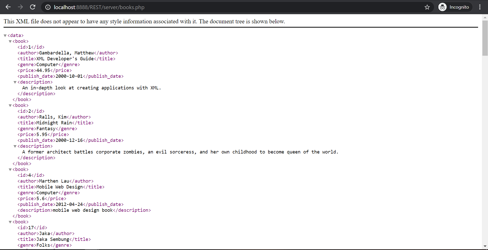
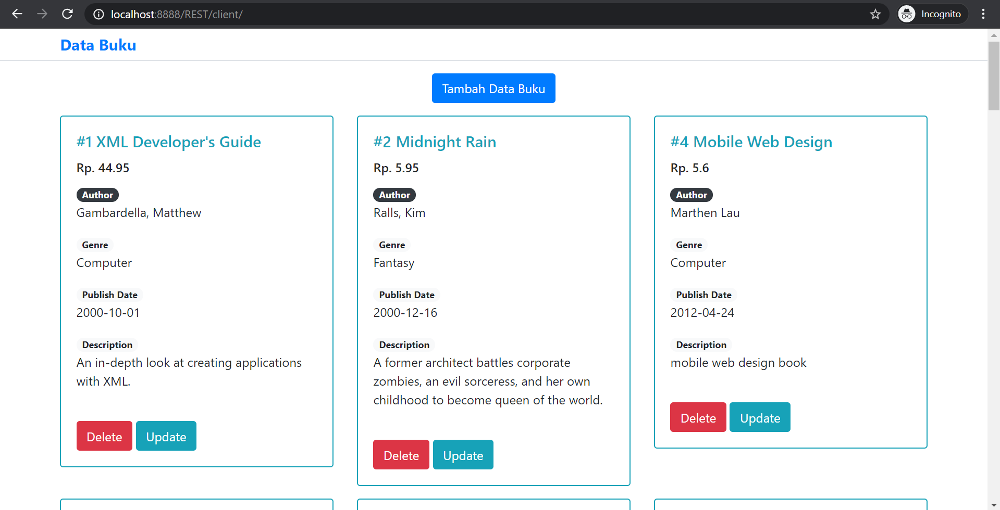

<h1>WEB SERVICE - REST praktikum 4 <h1> 
  
# Deskripsi
 

Aplikasi ini merupakan aplikasi implementasi <b>RESTful Web Service</b>

# Penggunaan

**ENDPOINTS data buku**

Method `GET`  
Endpoints `http://HOST:PORT/REST/server/books.php`

Method `POST`  
Endpoints `http://HOST:PORT/REST/server/books.php`

Method `GET`  
Endpoints `http://HOST:PORT/REST/server/books.php/{$id}`

Method `POST`  
Endpoints `http://HOST:PORT/REST/server/books.php/{$id}`

Method `DELETE`  
Endpoints `http://HOST:PORT/REST/server/books.php/{$id}`

## Contributors
- [Dewi Wulan Sari](https://github.com/dewiwss) -- 177006021
- [Sheila Maulida Intani](https://github.com/sheilamaulidaintani) -- 177006012
- [Fadilah Salsabila](https://github.com/fadilahsalsa) -- 177006006
